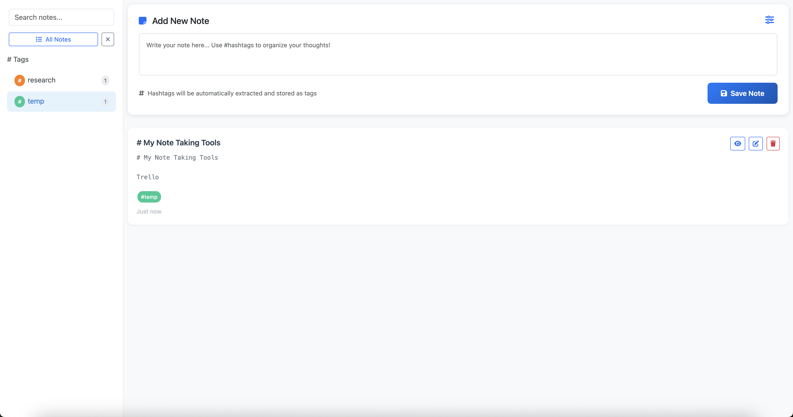

# 📝 My Notes

**My Notes** is a simple, self-hosted note-taking application built with scalability in mind. Powered by **Node.js** and **MySQL**, it provides a clean, organized, and extensible way to manage your notes — accessible via any browser and suitable for both personal and public use.

While there are many browser and desktop-based note-taking solutions, this project was born out of the need for a **lightweight, powerful, and fully user-controlled** alternative. The goal is to keep things simple while offering total ownership of your data.

---



---

## ✨ Features

* 🧩 Easy to deploy and self-host
* ⚙️ Scalable architecture with Node.js and MySQL
* 🗃️ Automatic database schema initialization
* 💡 Minimalist, distraction-free UI
* 🌍 Public availability out-of-the-box (authentication optional)

---

## 🚀 Hosting Instructions

Follow these steps to set up and run **My Notes** on your server:

### 📦 Prerequisites

* [Node.js](https://nodejs.org/) (v20+)
* [PM2](https://pm2.keymetrics.io/) (for managing processes)
* [MySQL](https://www.mysql.com/) database

---

### 🔧 Setup

1. **Download and extract** the ZIP archive of the project.

2. **Create environment configuration:**

   ```bash
   cp env_sample .env
   ```

3. **Edit `.env`** and add your MySQL connection details.

   > ✅ *Only the database needs to be created manually. Tables will be auto-generated on first run.*

4. **Start the application** with one of the following commands:

   ```bash
   npm start
   # or
   node index.js
   # or (recommended for production)
   pm2 start ecosystem.config.js
   ```

5. **Access the application** at:
   [http://localhost:3001](http://localhost:3001)

6. **Public Hosting (Optional):**
   Use a reverse proxy like **Nginx** to expose the service over the internet.

---

### 🔐 Note on Security

Authentication is **not yet implemented**. The current version is fully open to all users. Login and security features are planned for a future release.

---

## 🙌 Happy Note-Taking!

Contributions are welcome! Feel free to fork, customize, and enhance the project. Together, let’s build a better way to take and manage notes.
